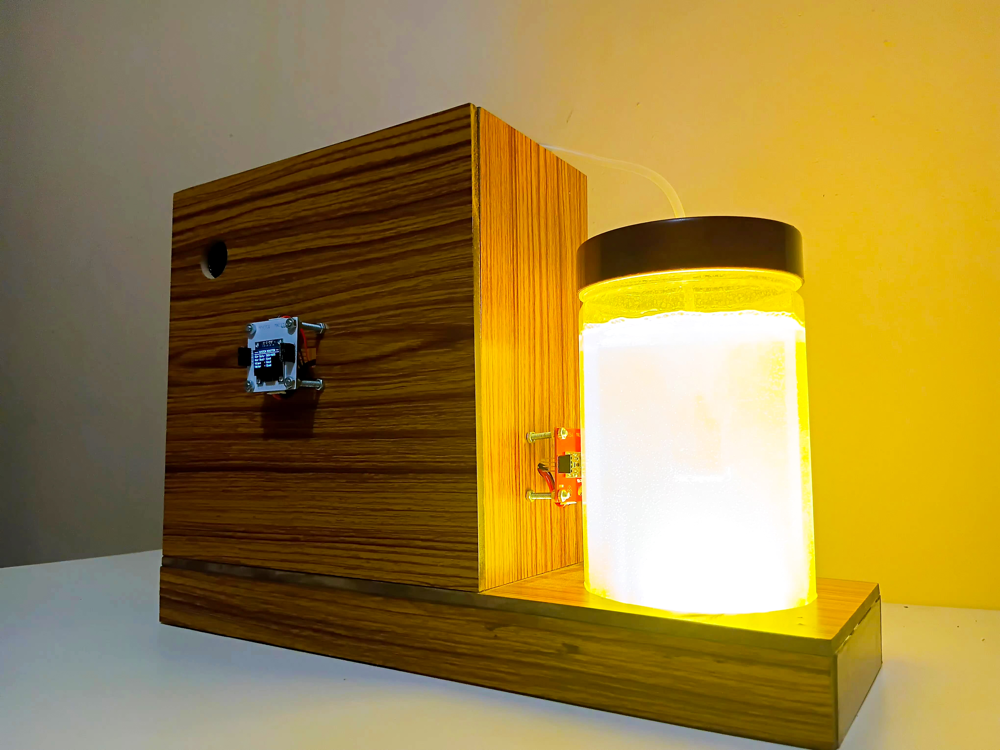

<div align="center">
  <p><a></a></p>
</div>

#### Publish Date: 2025-12-31

#### Title: SmartBio Air: AI-Driven Indoor Algae Based Air Purification System Using MYOSA Mini IoT Kit

#### Excerpt: An indoor air purification and research system that integrates living algae, multi-sensor environmental sensing, Edge AI–based safety control, and Cloud AI–assisted research analysis using the MYOSA Mini IoT Kit.


---

## Contributors  

- **Nimalan P** - [@nimalan-parameswaran](https://github.com/nimalan-parameswaran)  
- **Dhakshatha M K** - [@DhakshathaMylsamy](https://github.com/DhakshathaMylsamy)
  
---

## Acknowledgement 
We express our sincere thanks and profound gratitude to the **IEEE International MYOSA 4.0 Committee Members** for shortlisting our project from a large number of submitted proposals and for supporting this work through the provision of a **USD 250 MYOSA Mini IoT Kit**.

We are grateful to the **IEEE Sensors Council** for its continued encouragement and support of student-led research and applied engineering initiatives.

We extend our special thanks to **Dr. Dinesh Chellappan**, Centre for Research and Development, for his valuable guidance, technical direction, and mentorship throughout the course of this project.

Finally, we acknowledge **Ms. Pinki Dey**, Assistant Professor II, Department of Biomedical Engineering, for her assistance with the cultivation and maintenance of the *Spirulina* culture, which forms a fundamental biological component of this work.

---

<p align="center">
  
</p>

---

## Overview  

**SmartBio Air** is an indoor air purification and experimental research system that combines biological air treatment using algae with multi-sensor environmental monitoring and intelligent control. The system is designed not only to support indoor air purification, but also to experimentally observe and document the relationship between environmental conditions, air pollutants, and algae growth behavior over time.

The platform operates using a hybrid intelligence model in which time-sensitive and safety-related decisions are executed locally on the MYOSA Mini IoT Kit, while research-oriented observation, data correlation, and long-term interpretation are performed using cloud-based AI services. This separation allows continuous and safe operation during network unavailability, while still enabling extended scientific investigation when connectivity is present.

The system architecture is bifurcated into two synchronized operational states:

- **Primary Edge Control Mode**, which prioritises autonomous operation, motor pump protection, and air quality response using on-device inference and predefined threshold logic. This mode supports uninterrupted air purification without dependence on internet connectivity.

- **Cloud AI Agent Mode**, which is primarily intended for research purposes. In this mode, full sensor data is transmitted to the cloud to study how algae growth responds to changes in air pollution levels, light conditions, temperature, and other environmental factors. Centralised data logging, AI agent–based reasoning, and web-based visualisation support long-term analysis and pattern identification.

By combining biological air treatment, Edge AI–based safety mechanisms, and cloud-assisted research workflows, SmartBio Air functions both as a practical indoor air purification system and as a research platform suitable for studies in TinyML, IoT-based environmental sensing, and sustainable bio-assisted systems.

---

## Background  
Indoor air pollution has become a growing concern due to increased time spent in enclosed environments and the presence of gaseous pollutants such as carbon monoxide, volatile organic compounds, and particulate matter. Conventional air purification systems rely mainly on mechanical filtration or chemical absorption, which often require frequent maintenance and do not contribute to long-term environmental sustainability.

Biological air treatment using microalgae has gained research interest due to its natural ability to absorb carbon dioxide and certain airborne contaminants while producing oxygen through photosynthesis. Despite this potential, most algae-based purification systems remain confined to laboratory studies and lack real-time sensing, adaptive control, and long-term observational capability.

Recent progress in Internet of Things platforms, Edge AI, and cloud-based analytics allows biological systems to be monitored continuously and studied under real environmental conditions. Integrating these technologies offers an opportunity to bridge the gap between biological air purification research and deployable indoor systems.

---

## Problem Statement  
Existing indoor air purifiers operate as isolated mechanical systems with limited environmental awareness and no capacity to study biological purification processes over time. Algae-based air purification concepts, while promising, often lack continuous monitoring, fault tolerance, and autonomous operation required for indoor deployment.

There is a lack of systems that can safely operate in real environments while simultaneously collecting structured data to study how algae growth responds to air pollution levels, light conditions, and environmental changes. Network dependence further limits reliability, as cloud-only solutions cannot guarantee uninterrupted operation.

A system is required that supports autonomous air purification, protects hardware components, and enables controlled scientific observation without compromising safety or continuity.

---

## Project Objectives  
The primary objectives of this project are:

- To design an indoor air purification system that incorporates living algae as a biological air treatment medium

- To monitor indoor air quality and environmental parameters using multiple sensors

- To implement on-device intelligence for safety-critical operation and motor pump protection

- To study the relationship between air pollution levels, environmental conditions, and algae growth behavior

- To support long-term data collection and visualization for research and analysis

---
## Solution  
SmartBio Air proposes a hybrid Edge AI and Cloud AI system deployed on the MYOSA Mini IoT Kit. The system integrates gas sensors, environmental sensors, and a biologically active algae chamber to support both air purification and research observation.

Time-sensitive decisions such as air quality response and motor pump health classification are executed locally on the device using on-device inference and threshold logic. For research purposes, sensor data is transmitted to cloud-based services where it is stored, correlated, and interpreted using AI agents.

The system operates in two modes: a primary Edge control mode for uninterrupted autonomous operation and a Cloud AI Agent mode intended for environmental analysis and algae growth research.

<p align="center">
  
</p>

<h1 align="center"> Prototype </h1>

---
## Process Flow:
<p align="center">
  
</p>

---

## Demo  

### Images  
_Add images of the system setup, algae chamber, sensor wiring, OLED output, and web dashboard._

### Videos  
---

<p align="center">
  
</p>

---

<p align="center">
  
</p>

<p></p>  GitHub Static Web App
---

## Novelty  

- Integration of living microalgae as an active biological air treatment component within an intelligent indoor air purification system  

- Dual-mode system architecture that separates safety-critical Edge AI operation from cloud-based research and analysis  

- Use of on-device TinyML inference for motor pump health monitoring using vibration data  

- Continuous multi-sensor environmental monitoring linked directly to biological response observation  

- Cloud-assisted research workflow designed specifically to study the relationship between algae growth and air pollution levels  

- Autonomous offline operation that maintains air purification and system safety during network unavailability  

- Modular and reproducible design using the MYOSA Mini IoT Kit, enabling educational, research, and experimental reuse  

---

## Scope of the Project  
The scope of this project includes indoor air quality monitoring, algae-based biological air treatment, autonomous motor control, and cloud-assisted data analysis within controlled indoor environments.

The project focuses on system design, sensing, data collection, and observational study rather than clinical validation of health outcomes. Large-scale deployment, medical certification, and industrial manufacturing considerations are outside the present scope.

---

## Expected Outcomes 
The expected outcomes of the project include:

- A functional indoor air purification prototype with algae-based biological treatment

- Reliable autonomous operation during network unavailability

- Continuous monitoring of air quality and environmental conditions

- A structured dataset linking air pollution levels with algae growth behavior

- A reusable platform suitable for academic study in TinyML, IoT-based sensing, and bio-assisted environmental systems

---

## Features (Detailed)  

- Algae-assisted indoor air purification chamber  
- Multi-gas monitoring using MQ-series sensors  
- Motor pump health classification using MPU6050 and Edge ML  
- Autonomous offline execution on MYOSA (ESP32)  
- Cloud-based AI agents for monitoring and research study  
- Local OLED display for system status and air quality level  
- Web-based visualization using a static dashboard  

---

## Usage Instructions  

1. Power the MYOSA Mini IoT Kit and connect all sensors securely  
2. Allow MQ sensors sufficient warm-up time for stable readings  
3. Observe system state and air quality on the OLED display  
4. In offline mode, the system executes fully on-device  
5. In online mode, sensor data is transmitted to Azure for AI processing  
6. View environmental trends and system summaries through the web dashboard  

---

## Tech Stack  

### Hardware  
- MYOSA Motherboard (ESP32)  
- MPU6050  
- APDS9960  
- BMP180
- SSD1306 OLED
- L298N
- 3.3V Mini Fan
- MQ-2, MQ-3, MQ-7, MQ-135
- 6V DC Motor Air Pump
- 4 Channel 12V Relay Board
- 12V Plant Grow LED


### Firmware  
- Arduino 
- Edge Impulse TinyML inference  

### Cloud  
- Microsoft Azure Functions  
- Azure OpenAI services

### Frontend  
- HTML  
- CSS  
- JavaScript
- GitHub Page

---

## Requirements / Installation  

- MYOSA Mini IoT Kit  
- Arduino IDE or PlatformIO  
- Edge Impulse account for model deployment  
- Microsoft Azure account  
- Stable power supply for continuous operation  

Flash the firmware to the MYOSA board after configuring Wi-Fi credentials and cloud endpoints.

---

## File Structure (Optional)  

```
SmartBio-Air/
├── firmware/
│ ├── sensors/
│ ├── edge_ml/
│ └── main.ino
├── cloud/
│ └── azure-function/
├── web/
│ └── static-dashboard/
├── docs/
│ └── diagrams/
└── README.md
```

## License
This project may be released under the **MIT License** or another academic-friendly open-source license, subject to publication requirements.

---

## Contribution Notes (Optional)  
This repository is intended for research and educational use.  
Contributors are encouraged to document experimental conditions, sensor calibration steps, and data collection procedures clearly when submitting updates.
